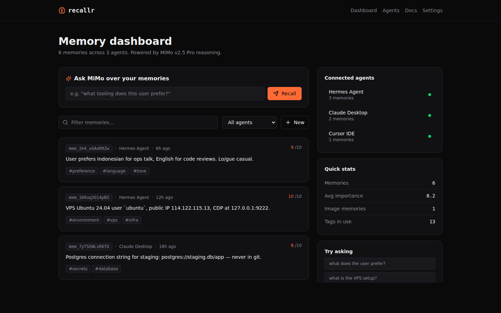

# Recallr

> Long-term memory for AI agents. Powered by **Xiaomi MiMo v2.5 Pro + VL**.

🌐 **Live demo:** [recallr.vercel.app](https://recallr.vercel.app)



AI agents (Claude, Cursor, Hermes, your own) lose context between sessions. Recallr
is a persistent memory layer they can write to, recall from, and reason over —
across text, images, and voice — with MiMo doing the heavy thinking.

## What Recallr does

- **Write** &mdash; agents POST text/image/voice. **MiMo VL** captions images and
  extracts structured tags. **MiMo v2.5 Pro** scores long-term importance 0&ndash;10
  and produces a one-line rationale stored on the memory.
- **Recall** &mdash; agents query semantically. Top-K memories pass through
  **MiMo v2.5 Pro reasoning**, returning answer + reasoning trace + cited
  memory IDs.
- **Forget** &mdash; per-tag TTL rules, importance-based auto-decay, manual
  delete via dashboard or API.
- **MCP-native** &mdash; the `@recallr/mcp` package exposes
  `recallr_remember`, `recallr_recall`, `recallr_forget` to any
  MCP-compatible client.

## Why MiMo

Memory engines need three things and MiMo nails the first two cheaply:

| Need | MiMo answer |
|------|-------------|
| Multimodal entity extraction | **MiMo v2.5 VL** captions screenshots, photos, and sketches into searchable tags |
| Reasoning over retrieved context | **MiMo v2.5 Pro** explains why each memory was cited &mdash; trace stored for audit |
| Importance scoring | **MiMo Pro** rates each memory 0&ndash;10 to drive auto-decay |

The reasoning trace is the killer feature. Other memory layers retrieve;
Recallr explains.

## Architecture


```
Agent (Claude / Hermes / Cursor)
     │
     ├── MCP Server (@recallr/mcp)
     │   └── 3 tools: remember, recall, forget
     │
     └── REST API (/api/v1/*)
           │
           ├── MiMo VL  → image → tags + caption
           ├── MiMo Pro → importance 0-10 + reasoning trace
           └── Memory service → pgvector + Postgres
```

## Tech stack

- **Next.js 16** (App Router, Turbopack, RSC)
- **MiMo via OpenRouter** &mdash; `xiaomi/mimo-v2.5-pro` (text reasoning),
  `xiaomi/mimo-v2.5` (multimodal VL)
- **Postgres + pgvector** for embeddings (production)
- **NextAuth v5** with Google + GitHub
- **Drizzle ORM** for migrations
- **Tailwind v4** + custom dark UI
- **TypeScript strict** end-to-end
- **Vercel** edge runtime for API routes

## Pages

| Route | What it is |
|-------|-----------|
| `/` | Landing &mdash; problem, solution, MCP demo |
| `/dashboard` | Memory browser, recall console, add memory |
| `/agents` | Connected agents + API keys |
| `/memory/[id]` | Single memory detail with reasoning trace + related |
| `/docs` | API + MCP integration guide |
| `/settings` | Retention rules, privacy, export |

## Getting started

```bash
git clone https://github.com/daretoleapp/recallr
cd recallr
pnpm install
cp .env.example .env
# add OPENROUTER_API_KEY for live MiMo, otherwise corpus mode kicks in
pnpm dev
```

Open `http://localhost:3000`. The seed data ships with 6 example memories
across 3 mock agents (Hermes, Claude Desktop, Cursor) so the dashboard
works zero-config.

## Graceful fallback

When `OPENROUTER_API_KEY` is missing or returns 402/429/5xx, Recallr falls
back to **corpus mode**: top-K by recency, no reasoning trace, response
header `x-recallr-source: corpus`. This is intentional &mdash; the demo
should work even when API budget hits zero. The MiMo integration code is
the proof; live calls are graceful.

```ts
export class MimoUnavailableError extends Error {}
export class MimoUpstreamError extends Error {
  constructor(public status: number, msg: string) { super(msg); }
}
export const isMimoFallback = (e: unknown) =>
  e instanceof MimoUnavailableError || e instanceof MimoUpstreamError;
```

## Roadmap

- [x] MiMo VL image captioning at write time
- [x] MiMo Pro reasoning trace at recall time
- [x] MiMo Pro importance scoring + decay
- [ ] pgvector production deployment
- [ ] Voice memories via MiMo audio (when available)
- [ ] Memory graph view (entity links across memories)
- [ ] Agent-to-agent memory sharing with explicit ACL
- [ ] Encrypted at rest with per-agent KMS keys

## License

MIT.

---

Built for the [MiMo Orbit 100T grant](https://100t.xiaomimimo.com).
